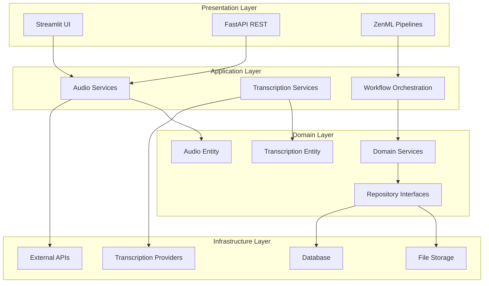
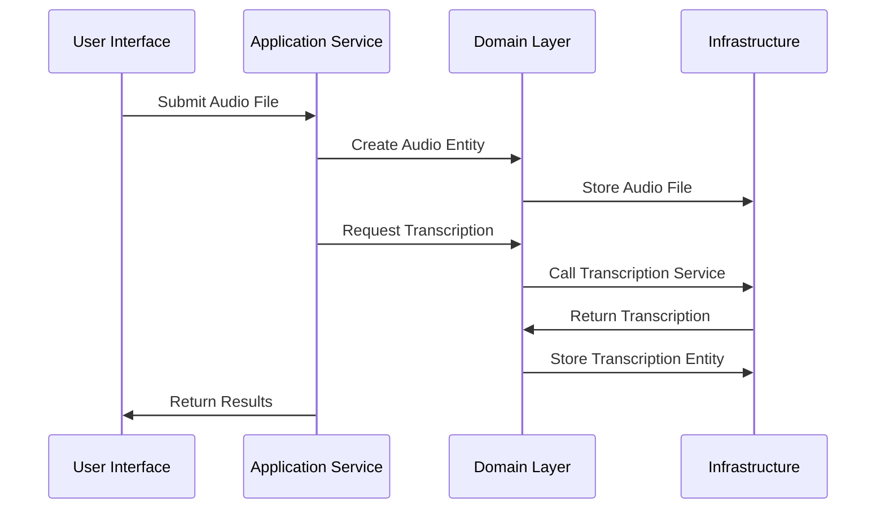
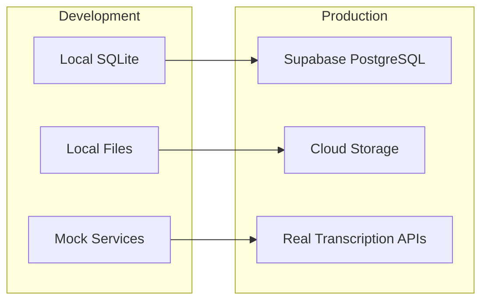

# 🏗️ ADR-001: System Architecture Overview

> [!IMPORTANT]
> **Status:** Accepted - This document provides the foundational architectural overview for the audio transcription system.

## Table of Contents

- [🏗️ ADR-001: System Architecture Overview](#️-adr-001-system-architecture-overview)
  - [Table of Contents](#table-of-contents)
  - [📋 Context](#-context)
  - [🎯 Decision](#-decision)
    - [🏛️ 1. High-Level Architecture](#️-1-high-level-architecture)
    - [🔄 2. Component Interaction](#-2-component-interaction)
    - [💾 3. Data Flow](#-3-data-flow)
    - [🛠️ 4. Technology Stack](#️-4-technology-stack)
    - [📦 5. Deployment Architecture](#-5-deployment-architecture)
  - [📈 Consequences](#-consequences)
    - [✅ Positive](#-positive)
    - [❌ Negative](#-negative)
    - [⚖️ Neutral](#️-neutral)
  - [🚀 Implementation](#-implementation)
  - [🔗 Related ADRs](#-related-adrs)

[↑ Back to Top](#table-of-contents)

## 📋 Context

The audio transcription system requires a scalable, maintainable architecture that supports multiple transcription services, handles audio file processing, and provides both API and UI interfaces. The system must accommodate future growth while maintaining clean separation of concerns and testability.

Key requirements:
- Process audio files for transcription
- Support multiple transcription service providers (local, cloud-based)
- Provide REST API and web UI interfaces  
- Enable ML pipeline orchestration with ZenML
- Maintain clean architecture with domain-driven design
- Support multiple storage backends (development to production)

> [!WARNING]
> This architecture must balance rapid experimentation capabilities with production-ready scalability.

[↑ Back to Top](#table-of-contents)

## 🎯 Decision

### 🏛️ 1. High-Level Architecture
[↑ Back to Top](#table-of-contents)

The system follows a **layered architecture** with **domain-driven design** principles:



**Layer Responsibilities:**
- **Presentation**: User interfaces and external API endpoints
- **Application**: Business workflow coordination and use cases
- **Domain**: Core business logic and entities
- **Infrastructure**: External integrations and persistence

### 🔄 2. Component Interaction
[↑ Back to Top](#table-of-contents)

**Core Components:**

1. **Audio Processing Pipeline**
   - Audio file validation and preprocessing
   - Metadata extraction and storage
   - Format normalization

2. **Transcription Engine**
   - Multiple provider support (Mock, Local, Cloud)
   - Asynchronous processing capability
   - Result aggregation and post-processing

3. **Data Management**
   - Entity-first database design
   - Multiple storage backend support
   - Repository pattern for data access

4. **Orchestration Layer**
   - ZenML pipeline integration
   - Workflow state management
   - Error handling and retry logic

**Interaction Flow:**


### 💾 3. Data Flow
[↑ Back to Top](#table-of-contents)

**Audio File Lifecycle:**
1. **Upload** → Validation → Storage
2. **Processing** → Metadata extraction → Entity creation
3. **Transcription** → Service selection → Async processing
4. **Storage** → Entity persistence → Result availability
5. **Retrieval** → Query processing → Response formatting

**Data Storage Strategy:**
- **Development**: Local file system + SQLite
- **Production**: Cloud storage + PostgreSQL (Supabase)
- **Entities**: Domain entities as source of truth for all schemas

### 🛠️ 4. Technology Stack
[↑ Back to Top](#table-of-contents)

**Core Technologies:**
```yaml
Backend Framework: FastAPI
ML Orchestration: ZenML  
UI Framework: Streamlit
Language: Python 3.11+
Architecture: Domain-Driven Design

Data & Storage:
  Development: SQLite + Local Files
  Production: PostgreSQL (Supabase) + Cloud Storage
  ORM: SQLAlchemy (Imperative Mapping)

Quality Assurance:
  Testing: Pytest
  Type Checking: MyPy
  Linting: Ruff
  Formatting: Black
  Task Runner: Makefile

Configuration:
  Settings: Pydantic Settings
  Environment: dotenv
  Dependency Injection: Factory Pattern
```

**External Integrations:**
- Audio processing libraries (librosa, pydub)
- Transcription services (configurable providers)
- File storage (local/cloud agnostic)

### 📦 5. Deployment Architecture
[↑ Back to Top](#table-of-contents)

**Environment Strategy:**



**Deployment Patterns:**
- **Local Development**: Single-process with embedded database
- **Production**: Distributed services with managed database
- **CI/CD**: Automated testing with multiple backend validation

[↑ Back to Top](#table-of-contents)

## 📈 Consequences

### ✅ Positive
[↑ Back to Top](#table-of-contents)

- **Scalability**: Layered architecture supports independent scaling
- **Maintainability**: Clean separation of concerns enables focused development
- **Testability**: Repository pattern and dependency injection enable comprehensive testing
- **Flexibility**: Multiple storage and service backends support various deployment scenarios
- **Developer Experience**: Clear architectural boundaries reduce cognitive load
- **Production Readiness**: Database-agnostic design supports smooth environment transitions

### ❌ Negative
[↑ Back to Top](#table-of-contents)

- **Complexity**: Multiple layers increase initial setup and learning curve
- **Performance Overhead**: Abstraction layers may introduce latency
- **Development Overhead**: DDD patterns require more upfront design effort

> [!WARNING]
> The layered architecture requires discipline to maintain proper dependency direction and avoid architectural violations.

### ⚖️ Neutral
[↑ Back to Top](#table-of-contents)

- **Technology Choices**: Current stack serves needs but could be replaced if requirements change
- **File Organization**: Domain co-location prioritizes development velocity over strict layer separation
- **Database Strategy**: Entity-first approach trades some query optimization for domain integrity

[↑ Back to Top](#table-of-contents)

## 🚀 Implementation

**Architecture Validation Checklist:**
- [x] Domain entities remain pure (no infrastructure dependencies)
- [x] Repository interfaces defined in domain layer
- [x] Application services coordinate business workflows
- [x] Infrastructure implementations provide concrete behavior
- [x] ZenML integration maintains architectural boundaries

**Development Guidelines:**
1. **New Features**: Start with domain entity and repository interface
2. **External Integrations**: Implement in infrastructure layer with domain interfaces
3. **Business Logic**: Place in domain services or application services
4. **UI/API**: Keep thin, delegate to application services

**Monitoring Points:**
- Dependency direction enforcement
- Layer boundary violations
- Performance bottlenecks at abstraction points

[↑ Back to Top](#table-of-contents)

## 🔗 Related ADRs

This foundational architecture is detailed in these related ADRs:
- [ADR-002: Domain-Driven Design Architecture](002-domain-driven-design-architecture.md) - DDD implementation details
- [ADR-003: Application Layer Patterns](003-application-layer-patterns.md) - ZenML integration and application services
- [ADR-007: Entity-First Database Design](007-entity-first-database-design.md) - Data persistence strategy

> [!NOTE]
> This ADR provides the high-level architectural foundation that all other architectural decisions build upon.

[↑ Back to Top](#table-of-contents)

---

**Architecture Version:** 1.0.0  
**Last Updated:** 2025-06-04  
**Review Cycle:** Quarterly or when significant technology changes occur 