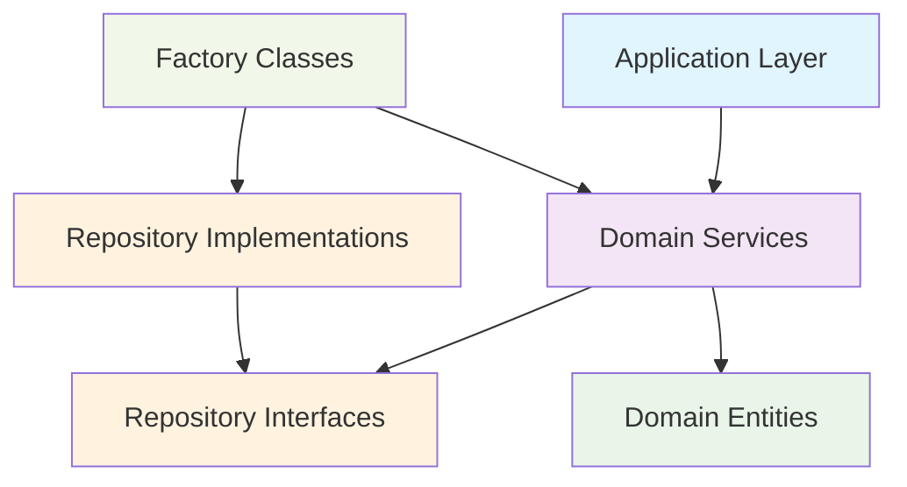
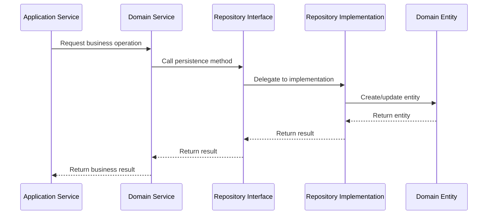

# 🏗️ ADR-002: Domain-Driven Design Architecture

> [!IMPORTANT]
> **Status:** Accepted - This architectural decision defines the core DDD implementation for all feature development.

## Table of Contents

- [🏗️ ADR-002: Domain-Driven Design Architecture](#️-adr-002-domain-driven-design-architecture)
  - [Table of Contents](#table-of-contents)
  - [📋 Context](#-context)
  - [🎯 Decision](#-decision)
    - [🔧 1. Pure Domain Entities](#-1-pure-domain-entities)
    - [📊 2. Repository Pattern](#-2-repository-pattern)
    - [⚙️ 3. Domain Service Architecture](#️-3-domain-service-architecture)
    - [🔄 4. Dependency Flow](#-4-dependency-flow)
    - [🎭 5. Bounded Contexts](#-5-bounded-contexts)
  - [📈 Consequences](#-consequences)
    - [✅ Positive](#-positive)
    - [❌ Negative](#-negative)
    - [⚖️ Neutral](#️-neutral)
  - [🚀 Implementation](#-implementation)
  - [🔗 Related ADRs](#-related-adrs)

[↑ Back to Top](#table-of-contents)

## 📋 Context

The audio transcription system initially mixed domain and infrastructure concerns, with entities containing repository references and persistence logic. This violated Domain-Driven Design (DDD) principles and created tight coupling between layers.

The system requires a clean domain-driven architecture that:
- Separates business logic from infrastructure concerns
- Enables testable domain logic through dependency inversion
- Supports multiple storage and service implementations
- Maintains development velocity while enforcing architectural boundaries

> [!WARNING]
> The original implementation created tight coupling between domain and infrastructure layers, making the code difficult to test and maintain.

[↑ Back to Top](#table-of-contents)

## 🎯 Decision

### 🔧 1. Pure Domain Entities
[↑ Back to Top](#table-of-contents)

Domain entities will be **pure data structures** with business behavior only:

```python
@dataclass
class TranscriptionEntity:
    """Pure domain entity - no infrastructure dependencies"""
    id: UUID
    audio_id: UUID
    content: str
    status: TranscriptionStatus
    created_at: datetime
    updated_at: datetime
    
    def is_complete(self) -> bool:
        """Business logic - domain behavior only"""
        return self.status == TranscriptionStatus.COMPLETED
    
    def update_content(self, content: str) -> None:
        """Domain operation - no persistence concerns"""
        self.content = content
        self.updated_at = datetime.utcnow()
```

**Entity Principles:**
- No repository references or persistence methods
- Focus solely on representing domain concepts
- Enforce business rules and invariants
- Contain domain behavior, not infrastructure concerns

> [!TIP]
> Pure domain entities make your business logic more testable and easier to reason about.

### 📊 2. Repository Pattern
[↑ Back to Top](#table-of-contents)

**Interfaces in Domain, Implementations in Infrastructure:**

```python
# Domain Layer - Repository Interface (Port)
class TranscriptionRepositoryInterface(ABC):
    """Domain contract for transcription persistence"""
    @abstractmethod
    def create(self, transcription: TranscriptionEntity) -> str:
        pass
    
    @abstractmethod
    def read(self, transcription_id: str) -> Optional[TranscriptionEntity]:
        pass

# Infrastructure Layer - Concrete Implementation (Adapter)
class MemoryTranscriptionRepository(TranscriptionRepositoryInterface):
    """Infrastructure implementation"""
    def __init__(self) -> None:
        self.storage: Dict[str, TranscriptionEntity] = {}
    
    def create(self, transcription: TranscriptionEntity) -> str:
        # Infrastructure-specific persistence logic
        if not transcription.id:
            transcription.id = str(uuid.uuid4())
        self.storage[transcription.id] = transcription
        return transcription.id
```

**Repository Responsibilities:**
- Domain interfaces define persistence contracts (ports)
- Infrastructure implementations provide concrete behavior (adapters)
- Multiple implementations support different storage strategies
- Repository abstractions enable dependency inversion

### ⚙️ 3. Domain Service Architecture
[↑ Back to Top](#table-of-contents)

Domain services orchestrate business workflows through dependency injection:

```python
class TranscriptionDomainService:
    """Domain service - orchestrates business logic"""
    def __init__(
        self,
        transcription_repo: TranscriptionRepositoryInterface,
        audio_repo: AudioRepositoryInterface
    ):
        # Depend on abstractions, not concretions
        self._transcription_repo = transcription_repo
        self._audio_repo = audio_repo
    
    def create_transcription(self, audio_id: str, content: str) -> str:
        """Business workflow - pure domain logic"""
        # Validate business rules
        audio = self._audio_repo.read(audio_id)
        if not audio:
            raise AudioNotFoundError(audio_id)
        
        # Create domain entity
        transcription = TranscriptionEntity(
            id=None,  # Repository will assign
            audio_id=audio_id,
            content=content,
            status=TranscriptionStatus.COMPLETED,
            created_at=datetime.utcnow(),
            updated_at=datetime.utcnow()
        )
        
        # Delegate persistence to repository
        return self._transcription_repo.create(transcription)
```

**Service Principles:**
- Receive dependencies through constructor injection
- Use repository interfaces, not implementations
- Contain complex business workflows
- Remain agnostic of persistence implementation details

### 🔄 4. Dependency Flow
[↑ Back to Top](#table-of-contents)

**Dependency Inversion Principle in Practice:**



**Flow Rules:**
- High-level modules don't depend on low-level modules
- Both depend on abstractions (repository interfaces)
- Infrastructure implementations depend on domain interfaces
- Factory classes wire concrete dependencies

### 🎭 5. Bounded Contexts
[↑ Back to Top](#table-of-contents)

**Current Domain Organization:**

```
src/domain/
├── audio/                          # Audio Bounded Context
│   ├── audio_entity.py            # Core audio domain model
│   ├── audio_repository_interface.py
│   └── audio_repository_memory.py
│
└── transcription/                  # Transcription Bounded Context
    ├── transcription_entity.py    # Core transcription domain model
    ├── transcription_repository_interface.py
    └── transcription_repository_memory.py
```

**Bounded Context Principles:**
- Each context has its own domain model
- Cross-context communication through well-defined interfaces
- Contexts can evolve independently
- Clear ownership and responsibility boundaries

> [!NOTE]
> File organization follows [ADR-004: File Organization Standards](004-file-organization-standards.md) for naming conventions and structure.

[↑ Back to Top](#table-of-contents)

## 📈 Consequences

### ✅ Positive
[↑ Back to Top](#table-of-contents)

- **Separation of Concerns**: Clear boundaries between domain and infrastructure
- **Testability**: Domain logic testable through repository mocking
- **Flexibility**: Multiple persistence strategies (JSON, SQLite, PostgreSQL)
- **Domain Focus**: Business logic remains pure and focused
- **Maintainability**: Changes to infrastructure don't affect domain logic
- **Development Velocity**: Co-location enables rapid iteration

### ❌ Negative
[↑ Back to Top](#table-of-contents)

- **Initial Complexity**: More files and interfaces to maintain
- **Learning Curve**: Team must understand DDD patterns
- **Setup Overhead**: Dependency injection requires careful wiring

> [!WARNING]
> The increased number of files and interfaces requires careful attention to maintain consistency across the codebase.

### ⚖️ Neutral
[↑ Back to Top](#table-of-contents)

- **Factory Pattern**: Requires factory classes for dependency wiring
- **Testing Strategy**: Need repository mocks for domain service testing
- **File Organization**: Trade-off between strict layer separation and development velocity

[↑ Back to Top](#table-of-contents)

## 🚀 Implementation

**DDD Implementation Checklist:**
- [x] Domain entities are pure (no infrastructure dependencies)
- [x] Repository interfaces defined in domain layer
- [x] Repository implementations in infrastructure layer
- [x] Domain services use dependency injection
- [x] Factory classes wire concrete dependencies

**Development Guidelines:**
1. **New Features**: Start with domain entity and repository interface
2. **Business Logic**: Place in domain entities or domain services
3. **Persistence**: Implement repository in infrastructure layer
4. **Testing**: Mock repository interfaces for domain service tests

**Implementation Sequence:**


**Migration Strategy:**
1. **Clean Entities**: Remove all persistence logic from domain entities
2. **Create Interfaces**: Define repository contracts in domain layer
3. **Implement Repositories**: Create concrete implementations in infrastructure
4. **Refactor Services**: Update services to use injected repositories
5. **Update Factories**: Wire dependencies through factory classes

[↑ Back to Top](#table-of-contents)

## 🔗 Related ADRs

This DDD architecture integrates with these related decisions:
- [ADR-001: System Architecture Overview](001-system-architecture-overview.md) - Overall system design context
- [ADR-003: Application Layer Patterns](003-application-layer-patterns.md) - Application service coordination
- [ADR-004: File Organization Standards](004-file-organization-standards.md) - File naming and structure conventions
- [ADR-007: Entity-First Database Design](007-entity-first-database-design.md) - Database schema generation from entities

> [!NOTE]
> This ADR replaces the original ADR-005 with enhanced navigation and reduced content duplication.

[↑ Back to Top](#table-of-contents)

---

**DDD Version:** 1.0.0  
**Last Updated:** 2025-06-04  
**References:** Evans (DDD), Martin (Clean Architecture), Cockburn (Hexagonal Architecture) 