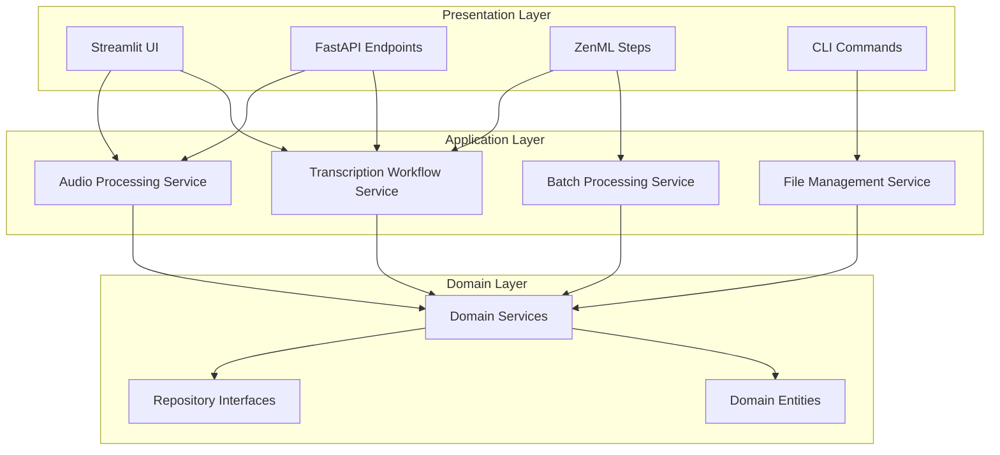
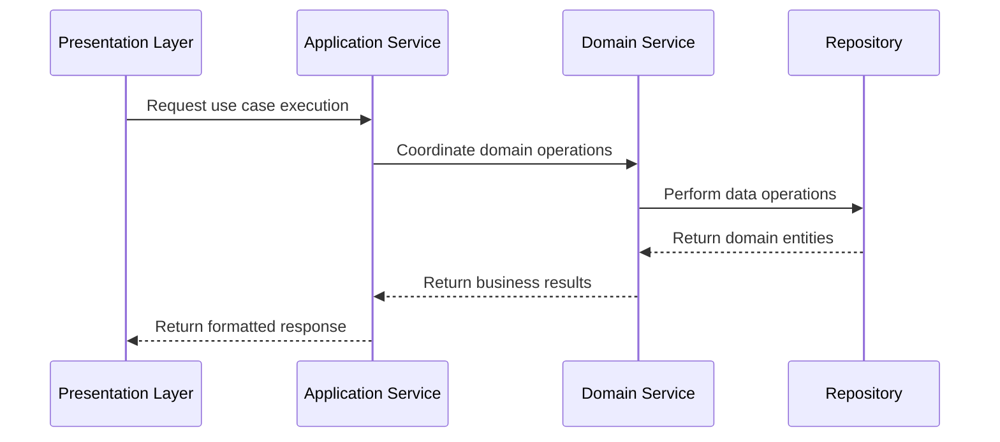

# ⚙️ ADR-003: Application Layer Patterns

> [!IMPORTANT]
> **Status:** Accepted - This defines the application layer architecture for orchestration, workflows, and business use cases.

## Table of Contents

- [⚙️ ADR-003: Application Layer Patterns](#️-adr-003-application-layer-patterns)
  - [Table of Contents](#table-of-contents)
  - [📋 Context](#-context)
  - [🎯 Decision](#-decision)
    - [🏗️ 1. Application Service Architecture](#️-1-application-service-architecture)
    - [🔄 2. ZenML Integration Pattern](#-2-zenml-integration-pattern)
    - [🌐 3. API Layer Integration](#-3-api-layer-integration)
    - [🎭 4. Use Case Orchestration](#-4-use-case-orchestration)
    - [📦 5. Dependency Injection Strategy](#-5-dependency-injection-strategy)
  - [📈 Consequences](#-consequences)
    - [✅ Positive](#-positive)
    - [❌ Negative](#-negative)
    - [⚖️ Neutral](#️-neutral)
  - [🚀 Implementation](#-implementation)
  - [🔗 Related ADRs](#-related-adrs)

[↑ Back to Top](#table-of-contents)

## 📋 Context

The audio transcription system requires an application layer that:
- Coordinates business workflows between UI, API, and ML pipelines
- Separates orchestration logic from domain business logic
- Enables reusable business operations across different interfaces (ZenML, FastAPI, Streamlit)
- Maintains clean architecture principles while supporting multiple presentation layers

**Key Challenges:**
- Business logic was embedded directly in ZenML steps, violating separation of concerns
- Domain logic wasn't reusable outside ZenML pipeline context
- Difficult to unit test workflows independently of orchestration frameworks
- Tight coupling between presentation layers and domain logic

> [!WARNING]
> Embedding business logic directly in presentation layers (ZenML steps, API endpoints) creates maintenance and testing challenges.

[↑ Back to Top](#table-of-contents)

## 🎯 Decision

### 🏗️ 1. Application Service Architecture
[↑ Back to Top](#table-of-contents)

**Application services act as the coordination layer** between presentation and domain:



**Application Service Principles:**
- **Coordination**: Orchestrate domain services to fulfill use cases
- **Framework Agnostic**: No dependencies on presentation frameworks
- **Reusable**: Same service used by API, UI, and ML pipelines
- **Stateless**: Don't maintain state between operations

**Example Application Service:**
```python
class AudioTranscriptionWorkflowService:
    """Application service - coordinates transcription workflow"""
    
    def __init__(
        self,
        audio_repo: AudioRepositoryInterface,
        transcription_repo: TranscriptionRepositoryInterface,
        transcription_service: TranscriptionServiceInterface
    ):
        self._audio_repo = audio_repo
        self._transcription_repo = transcription_repo
        self._transcription_service = transcription_service
    
    def process_audio_file(
        self, 
        file_path: str, 
        transcription_provider: str = "local"
    ) -> AudioTranscriptionResult:
        """Complete audio processing workflow"""
        # 1. Validate and store audio file
        audio_entity = self._validate_and_store_audio(file_path)
        
        # 2. Create transcription request
        transcription_request = self._create_transcription_request(
            audio_entity, transcription_provider
        )
        
        # 3. Execute transcription
        transcription_result = self._transcription_service.transcribe(
            transcription_request
        )
        
        # 4. Store results
        transcription_id = self._transcription_repo.create(transcription_result)
        
        return AudioTranscriptionResult(
            audio_id=audio_entity.id,
            transcription_id=transcription_id,
            status=transcription_result.status
        )
```

### 🔄 2. ZenML Integration Pattern
[↑ Back to Top](#table-of-contents)

**ZenML steps are thin wrappers** around application services:

```python
# ✅ ZenML Step - Thin Orchestration Wrapper
@step
def transcribe_audio_step(
    audio_file_path: str, 
    provider: str = "local"
) -> AudioTranscriptionResult:
    """ZenML step - delegates to application service"""
    
    # Dependency injection through factory
    workflow_service = ServiceFactory.create_transcription_workflow_service()
    
    # Delegate to application service
    result = workflow_service.process_audio_file(
        file_path=audio_file_path,
        transcription_provider=provider
    )
    
    return result

# ✅ ZenML Pipeline - Composes Steps
@pipeline
def audio_transcription_pipeline(
    audio_files: List[str],
    provider: str = "local"
) -> List[AudioTranscriptionResult]:
    """Pipeline orchestrates multiple steps"""
    
    results = []
    for audio_file in audio_files:
        # Each step delegates to application services
        result = transcribe_audio_step(audio_file, provider)
        results.append(result)
    
    return results
```

**ZenML Integration Benefits:**
- **Thin Layers**: ZenML steps contain minimal logic
- **Reusable Logic**: Application services work outside ZenML
- **Easy Testing**: Business logic testable without ZenML framework
- **Framework Independence**: Business logic doesn't depend on ZenML

### 🌐 3. API Layer Integration
[↑ Back to Top](#table-of-contents)

**FastAPI endpoints use the same application services:**

```python
# ✅ FastAPI Endpoint - Uses Application Service
@app.post("/api/transcriptions/")
async def create_transcription(
    audio_file: UploadFile,
    provider: str = "local"
) -> TranscriptionResponse:
    """API endpoint - delegates to application service"""
    
    # Same application service as ZenML
    workflow_service = ServiceFactory.create_transcription_workflow_service()
    
    # Save uploaded file temporarily
    temp_path = await save_uploaded_file(audio_file)
    
    try:
        # Delegate to application service
        result = workflow_service.process_audio_file(
            file_path=temp_path,
            transcription_provider=provider
        )
        
        return TranscriptionResponse(
            transcription_id=result.transcription_id,
            status=result.status.value,
            audio_id=result.audio_id
        )
    finally:
        # Cleanup
        Path(temp_path).unlink(missing_ok=True)
```

### 🎭 4. Use Case Orchestration
[↑ Back to Top](#table-of-contents)

**Application services implement specific use cases:**

```python
class BatchProcessingService:
    """Application service for batch operations"""
    
    def process_audio_batch(
        self, 
        audio_files: List[str],
        provider: str = "local",
        parallel: bool = True
    ) -> BatchProcessingResult:
        """Batch processing use case"""
        
        if parallel:
            return self._process_parallel(audio_files, provider)
        else:
            return self._process_sequential(audio_files, provider)
    
    def _process_parallel(self, files: List[str], provider: str) -> BatchProcessingResult:
        """Parallel processing implementation"""
        # Coordinate parallel transcription workflows
        pass

class FileManagementService:
    """Application service for file operations"""
    
    def import_audio_files(
        self, 
        source_directory: str,
        file_patterns: List[str]
    ) -> FileImportResult:
        """File import use case"""
        # Coordinate file discovery, validation, and import
        pass
```

### 📦 5. Dependency Injection Strategy
[↑ Back to Top](#table-of-contents)

**Factory pattern for application service creation:**

```python
class ServiceFactory:
    """Factory for creating application services with proper dependencies"""
    
    @staticmethod
    def create_transcription_workflow_service() -> AudioTranscriptionWorkflowService:
        """Create transcription workflow service with dependencies"""
        
        # Create repositories based on configuration
        audio_repo = RepositoryFactory.create_audio_repository()
        transcription_repo = RepositoryFactory.create_transcription_repository()
        transcription_service = TranscriptionServiceFactory.create()
        
        return AudioTranscriptionWorkflowService(
            audio_repo=audio_repo,
            transcription_repo=transcription_repo,
            transcription_service=transcription_service
        )
    
    @staticmethod
    def create_batch_processing_service() -> BatchProcessingService:
        """Create batch processing service"""
        workflow_service = ServiceFactory.create_transcription_workflow_service()
        
        return BatchProcessingService(
            workflow_service=workflow_service
        )
```

[↑ Back to Top](#table-of-contents)

## 📈 Consequences

### ✅ Positive
[↑ Back to Top](#table-of-contents)

- **Reusability**: Application services work across UI, API, CLI, and ML pipelines
- **Testability**: Business workflows testable without presentation frameworks
- **Maintainability**: Clear separation between orchestration and business logic
- **Framework Independence**: Business logic doesn't depend on ZenML or FastAPI
- **Clean Architecture**: Proper dependency flow from presentation to domain
- **Consistency**: Same business logic across all interfaces

### ❌ Negative
[↑ Back to Top](#table-of-contents)

- **Additional Complexity**: More layers and interfaces to maintain
- **Initial Overhead**: Requires careful dependency injection setup
- **Learning Curve**: Team needs to understand application service patterns

> [!WARNING]
> The additional abstraction layers require discipline to maintain proper separation and avoid leaking concerns between layers.

### ⚖️ Neutral
[↑ Back to Top](#table-of-contents)

- **Factory Pattern**: Requires factory classes for service creation
- **Service Granularity**: Need to balance service size and responsibility
- **Error Handling**: Consistent error handling across application services

[↑ Back to Top](#table-of-contents)

## 🚀 Implementation

**Application Layer Implementation Checklist:**
- [x] Application services coordinate domain operations
- [x] ZenML steps are thin wrappers around application services
- [x] API endpoints delegate to application services
- [x] Factory pattern provides dependency injection
- [x] Business logic remains framework-independent

**Development Guidelines:**
1. **New Use Cases**: Create application service to coordinate domain operations
2. **ZenML Steps**: Keep thin, delegate to application services
3. **API Endpoints**: Use same application services as ZenML
4. **Testing**: Test application services independently of presentation layers

**Implementation Pattern:**


**Refactoring Strategy:**
1. **Extract Services**: Extract business logic from ZenML steps into application services
2. **Update Steps**: Make ZenML steps thin wrappers around application services
3. **Share Services**: Use same application services in API endpoints
4. **Test Independently**: Create tests for application services without framework dependencies

[↑ Back to Top](#table-of-contents)

## 🔗 Related ADRs

This application layer architecture integrates with:
- [ADR-001: System Architecture Overview](001-system-architecture-overview.md) - Overall system design and layer responsibilities
- [ADR-002: Domain-Driven Design Architecture](002-domain-driven-design-architecture.md) - Domain layer that application services coordinate
- [ADR-005: Project Development Standards](005-project-development-standards.md) - Development workflow and command patterns
- [ADR-008: Comprehensive Testing Strategy](008-comprehensive-testing-strategy.md) - Testing strategies for application services

> [!NOTE]
> This ADR replaces the original ZenML separation ADR with broader application layer patterns that support multiple presentation frameworks.

[↑ Back to Top](#table-of-contents)

---

**Application Layer Version:** 1.0.0  
**Last Updated:** 2025-06-04  
**Focus:** Clean Architecture, Framework Independence, Reusability 