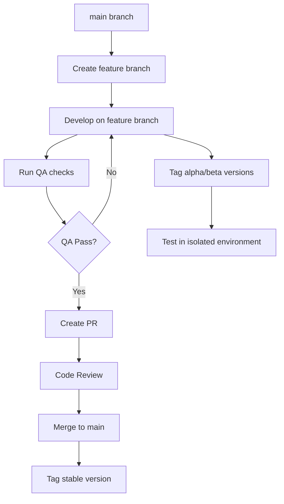

# 🔄 Git Workflow and Versioning Strategy

> [!IMPORTANT]
> This guide defines the essential Git workflow and versioning policies for the agent template. These policies ensure code quality, stable releases, and proper version management.

## Table of Contents

- [🔄 Git Workflow and Versioning Strategy](#-git-workflow-and-versioning-strategy)
  - [Table of Contents](#table-of-contents)
  - [🚨 Critical Git Policies](#-critical-git-policies)
    - [❌ NEVER Use `git add .`](#-never-use-git-add-)
    - [✅ Quality Assurance Before Commits](#-quality-assurance-before-commits)
    - [📋 Selective Staging Policy](#-selective-staging-policy)
  - [🌿 Branching Strategy](#-branching-strategy)
    - [🎯 Branch Types](#-branch-types)
    - [🏗️ Branch Naming Conventions](#️-branch-naming-conventions)
    - [🔄 Branch Workflow](#-branch-workflow)
  - [🏷️ Versioning Strategy](#️-versioning-strategy)
    - [📦 Version Types](#-version-types)
    - [🎯 Semantic Versioning](#-semantic-versioning)
    - [🌿 Branch-Based Versioning](#-branch-based-versioning)
  - [⚙️ Quality Assurance Workflow](#️-quality-assurance-workflow)
    - [🔍 Pre-Commit Checks](#-pre-commit-checks)
    - [🛠️ QA Commands](#️-qa-commands)
  - [🏷️ Git Tagging](#️-git-tagging)
    - [📝 Creating Tags](#-creating-tags)
    - [🚀 Pushing Tags](#-pushing-tags)
    - [🔍 Verifying Tags](#-verifying-tags)
  - [📝 Conventional Commit Messages](#-conventional-commit-messages)
    - [🎯 Commit Message Format](#-commit-message-format)
    - [📋 Commit Types](#-commit-types)
    - [🔍 Examples](#-examples)
  - [🚨 Common Issues and Solutions](#-common-issues-and-solutions)

[↑ Back to Top](#table-of-contents)

## 🚨 Critical Git Policies

### ❌ NEVER Use `git add .`
[↑ Back to Top](#table-of-contents)

> [!DANGER]
> **NEVER use `git add .` - All commits must be selective and reviewed**

**Forbidden Commands:**
```bash
# ❌ NEVER DO THIS
git add .
git add *
git add -A

# ❌ ALSO AVOID
git commit -am "message"  # This bypasses staging review
```

**Required Approach:**
```bash
# ✅ ALWAYS DO THIS - Review and stage files individually
git status                          # Review what changed
git diff path/to/file.py            # Review specific changes
git add path/to/file.py             # Stage specific files
git add src/module/specific_file.py # Be explicit about what you're committing
```

**Why This Policy Exists:**
- Prevents accidentally committing temporary files
- Ensures every change is intentionally reviewed
- Maintains clean commit history
- Prevents sensitive data from being committed
- Forces developers to understand what they're committing

### ✅ Quality Assurance Before Commits
[↑ Back to Top](#table-of-contents)

> [!IMPORTANT]
> **Complete quality assurance is REQUIRED before any git operation**

**Mandatory QA Process:**
```bash
# 1. Run comprehensive quality assurance with auto-fixes
make qa                             # Format + lint-fix + typecheck + validate-domain + test

# 2. Verify no errors
echo $?                            # Should return 0 (success)

# 3. Review changes one more time
git diff --staged                   # Review staged changes

# 4. Only then commit
git commit -m "feat(component): descriptive message"
```

**No Exceptions Policy:**
- All tests must pass
- All linting must pass
- All type checks must pass
- Code must be properly formatted
- Documentation must be updated if needed

### 📋 Selective Staging Policy
[↑ Back to Top](#table-of-contents)

**Proper Staging Workflow:**
```bash
# 1. Check status
git status

# 2. Review each file individually
git diff src/agent_project/domain/entities/agent.py

# 3. Stage specific files after review
git add src/agent_project/domain/entities/agent.py
git add tests/unit/domain/test_agent.py

# 4. Verify staged changes
git diff --staged

# 5. Commit with meaningful message
git commit -m "feat(agent): add conversation tracking to agent entity"
```

[↑ Back to Top](#table-of-contents)

## 🌿 Branching Strategy

### 🎯 Branch Types
[↑ Back to Top](#table-of-contents)

**Main Branch:**
- `main` - Always stable, production-ready code
- Protected branch with required PR reviews
- Only accepts merges from feature branches
- All tests must pass before merge

**Development Branches:**
- `feature/description` - New feature development
- `hotfix/description` - Critical bug fixes
- `refactor/description` - Code refactoring without feature changes
- `docs/description` - Documentation updates

### 🏗️ Branch Naming Conventions
[↑ Back to Top](#table-of-contents)

**Format:** `<type>/<description>`

**Examples:**
```bash
# Feature branches
feature/agent-conversation-tracking
feature/llm-provider-abstraction
feature/async-event-processing

# Hotfix branches
hotfix/memory-leak-in-agent-service
hotfix/validation-error-handling

# Refactor branches
refactor/repository-pattern-cleanup
refactor/settings-configuration-consolidation

# Documentation branches
docs/api-documentation-update
docs/architecture-decision-records
```

### 🔄 Branch Workflow
[↑ Back to Top](#table-of-contents)



**Step-by-Step Process:**
1. **Create Branch:** `git checkout -b feature/new-capability`
2. **Develop:** Make changes following our coding standards
3. **QA:** Run `make qa` and ensure all checks pass
4. **Commit:** Use selective staging and descriptive messages
5. **Push:** `git push origin feature/new-capability`
6. **PR:** Create pull request with detailed description
7. **Review:** Address review feedback
8. **Merge:** Merge to main after approval

[↑ Back to Top](#table-of-contents)

## 🏷️ Versioning Strategy

### 📦 Version Types
[↑ Back to Top](#table-of-contents)

**Stable Versions (main branch):**
- `v1.2.0` - Major release
- `v1.2.1` - Minor release
- `v1.2.2` - Patch release

**Development Versions (feature branches):**
- `v1.3.0-alpha.1` - Alpha release for testing
- `v1.3.0-beta.1` - Beta release for broader testing
- `v1.3.0-dev.1` - Development snapshot

### 🎯 Semantic Versioning
[↑ Back to Top](#table-of-contents)

Follow semantic versioning (SemVer) principles:

```
MAJOR.MINOR.PATCH
  │     │     │
  │     │     └── Bug fixes, no breaking changes
  │     └────────── New features, backwards compatible  
  └──────────────── Breaking changes, major updates
```

**Examples:**
- `v1.0.0` → `v1.0.1` - Bug fix
- `v1.0.1` → `v1.1.0` - New feature
- `v1.1.0` → `v2.0.0` - Breaking change

### 🌿 Branch-Based Versioning
[↑ Back to Top](#table-of-contents)

**Feature Branch Versioning:**
```bash
# On feature branch - tag alpha/beta versions for testing
git tag -a v1.3.0-alpha.1 -m "Alpha release: new agent conversation tracking"
git push origin v1.3.0-alpha.1

# Deploy to alpha environment for testing
```

**Main Branch Versioning:**
```bash
# After merge to main - tag stable version
git tag -a v1.3.0 -m "Release: agent conversation tracking feature"
git push origin v1.3.0

# Deploy to production environment
```

**Version Environments:**
- **Alpha versions** → Alpha testing environment
- **Beta versions** → Staging environment
- **Stable versions** → Production environment

[↑ Back to Top](#table-of-contents)

## ⚙️ Quality Assurance Workflow

### 🔍 Pre-Commit Checks
[↑ Back to Top](#table-of-contents)

**Mandatory Checks Before Any Commit:**
```bash
# Full QA workflow
make qa                    # Runs format, lint, and test
make clean                 # Clean up temporary files
git status                 # Review what will be committed
```

**QA Process Breakdown:**
1. **Code Formatting:** `make format` (ruff format)
2. **Linting:** `make lint` (ruff check - no fixes) / `make lint-fix` (with auto-fixes)
3. **Type Checking:** `make typecheck` (dedicated type validation)
4. **Domain Validation:** `make validate-domain` (ensure domain layer purity)
5. **Testing:** `make test` (pytest full suite)
6. **Unit/Integration:** `make test-unit` / `make test-integration` (targeted testing)

### 🛠️ QA Commands
[↑ Back to Top](#table-of-contents)

**Available QA Commands:**
```bash
# Individual commands
make format               # Format code with ruff
make lint                # Check linting (no fixes)
make lint-fix            # Check linting with auto-fixes
make typecheck           # Run dedicated type checking
make validate-domain     # Validate domain layer purity
make test                # Run complete test suite
make test-unit           # Run unit tests only
make test-integration    # Run integration tests only

# Combined commands  
make check               # Lint + typecheck + validate-domain + test
make check-fix           # Format + lint-fix + typecheck + validate-domain + test-unit + test-integration
make qa                  # Comprehensive QA with auto-fixes (same as check-fix)

# Development
make dev                # Setup + start development services
make clean              # Clean up temporary files
```

[↑ Back to Top](#table-of-contents)

## 🏷️ Git Tagging

### 📝 Creating Tags
[↑ Back to Top](#table-of-contents)

**Annotated Tags (Recommended):**
```bash
# Stable release on main
git tag -a v1.3.0 -m "Release: agent conversation tracking"

# Alpha/beta on feature branch
git tag -a v1.3.0-alpha.1 -m "Alpha: testing conversation tracking feature"

# Development snapshot
git tag -a v1.3.0-dev.1 -m "Dev snapshot: work in progress"
```

**Tag Naming Patterns:**
- **Stable:** `v{MAJOR}.{MINOR}.{PATCH}`
- **Pre-release:** `v{MAJOR}.{MINOR}.{PATCH}-{stage}.{number}`
- **Development:** `v{MAJOR}.{MINOR}.{PATCH}-dev.{number}`

### 🚀 Pushing Tags
[↑ Back to Top](#table-of-contents)

**Tags are NOT automatically pushed:**
```bash
# Push specific tag
git push origin v1.3.0

# Push all tags (use carefully)
git push origin --tags

# Push commits and tags together
git push origin --follow-tags
```

### 🔍 Verifying Tags
[↑ Back to Top](#table-of-contents)

**Check Tags:**
```bash
# List local tags
git tag -l

# List remote tags
git ls-remote --tags origin

# Show tag details
git show v1.3.0
```

[↑ Back to Top](#table-of-contents)

## 📝 Conventional Commit Messages

### 🎯 Commit Message Format
[↑ Back to Top](#table-of-contents)

> [!IMPORTANT]
> **All commits must follow conventional commit format to maintain clear project history and enable automated tooling**

**Required Format:**
```
<type>(<scope>): <description>

[optional body]

[optional footer(s)]
```

**Rules:**
- **Type:** Must be one of the defined types (see below)
- **Scope:** Optional, indicates component/module affected
- **Description:** Brief summary in imperative mood, lowercase, no period
- **Body:** Optional detailed explanation
- **Footer:** Optional for breaking changes, issues, etc.

### 📋 Commit Types
[↑ Back to Top](#table-of-contents)

**Primary Types:**
- `feat` - New features or capabilities
- `fix` - Bug fixes
- `docs` - Documentation changes only
- `style` - Code style changes (formatting, missing semicolons, etc.)
- `refactor` - Code changes that neither fix bugs nor add features
- `test` - Adding or modifying tests
- `chore` - Maintenance tasks, dependencies, build system

**Infrastructure Types:**
- `ci` - Changes to CI/CD configuration files and scripts
- `build` - Changes to build system or external dependencies
- `perf` - Performance improvements
- `revert` - Reverts a previous commit

### 🔍 Examples
[↑ Back to Top](#table-of-contents)

**Good Commit Messages:**
```bash
# Feature addition
feat(agent): add conversation tracking to agent entity

# Bug fix with scope
fix(database): resolve connection timeout in SQLAlchemy config

# Documentation update
docs(api): add examples for agent service endpoints

# Refactoring
refactor(domain): extract conversation factory to separate module

# Breaking change
feat(api)!: replace REST endpoints with GraphQL

# Multiple scopes
feat(agent,conversation): implement message persistence

# No scope needed
test: add integration tests for event bus
```

**Commit Message Best Practices:**
```bash
# ✅ Good - imperative mood, lowercase, concise
feat(auth): add JWT token validation

# ❌ Bad - past tense, capitalized, too vague
fix(Auth): Fixed some authentication bugs

# ✅ Good - specific scope and clear description
refactor(repository): extract database queries to separate methods

# ❌ Bad - no scope, unclear what changed
refactor: made some improvements

# ✅ Good - includes breaking change indicator
feat(api)!: remove deprecated v1 endpoints

# ❌ Bad - doesn't indicate breaking change
feat(api): update endpoints
```

**Multi-line Examples:**
```bash
feat(agent): implement conversation memory with context window

Add conversation history tracking with configurable context window size.
Includes automatic pruning of old messages and token counting for
optimal LLM performance.

Closes #123
```

**Validation Rules:**
- Type must be from approved list
- Description must be under 100 characters
- No period at end of description
- Use imperative mood ("add" not "adds" or "added")
- Breaking changes must include `!` after type/scope

### 🛠️ Local Commit Validation Setup
[↑ Back to Top](#table-of-contents)

> [!TIP]
> **Set up local commit validation to catch formatting issues before pushing**

**Option 1: Manual Validation (Recommended)**
```bash
# Install commitlint globally (one-time setup)
npm install -g @commitlint/cli @commitlint/config-conventional

# Validate commit message before committing
echo "feat(agent): add conversation tracking" | commitlint

# If valid, proceed with commit
git commit -m "feat(agent): add conversation tracking"
```

**Option 2: Git Hook (Automatic)**
```bash
# Install commitlint locally in project
npm install --save-dev @commitlint/cli @commitlint/config-conventional

# Add git hook to package.json or set up manually
echo '#!/bin/sh\nnpx commitlint --edit "$1"' > .git/hooks/commit-msg
chmod +x .git/hooks/commit-msg
```

**Option 3: Using Make Command**
Add to your commit workflow:
```bash
# Validate commit message format
make validate-commit-msg MSG="feat(agent): add conversation tracking"

# If valid, commit
git commit -m "feat(agent): add conversation tracking"
```

**Configuration File:**
The project includes `.commitlintrc.json` with rules for:
- Approved commit types
- Lowercase formatting requirements  
- Subject length limits (100 characters)
- Required structure validation

[↑ Back to Top](#table-of-contents)

## 🚨 Common Issues and Solutions

**Issue: Accidentally used `git add .`**
```bash
# Solution: Reset and stage selectively
git reset HEAD              # Unstage everything
git status                  # Review changes
git add specific-file.py    # Stage selectively
```

**Issue: Committed without QA**
```bash
# Solution: Amend commit after running QA
make qa                     # Run quality assurance
git add additional-fixes    # Stage any QA fixes
git commit --amend         # Amend the commit
```

**Issue: Wrong branch for development**
```bash
# Solution: Move commits to correct branch
git checkout main
git checkout -b feature/correct-branch
git cherry-pick commit-hash
```

**Issue: Need to test alpha version**
```bash
# Solution: Tag and deploy alpha version
git tag -a v1.3.0-alpha.1 -m "Alpha release for testing"
git push origin v1.3.0-alpha.1
# Deploy to alpha environment for testing
```

> [!NOTE]
> This workflow ensures code quality, stable releases, and proper version management while supporting both monolithic development and future microservice evolution.

[↑ Back to Top](#table-of-contents)

---

**Git Workflow Version:** 2.0.0  
**Last Updated:** 2025-06-27  
**Focus:** Quality assurance, selective commits, stable branching 