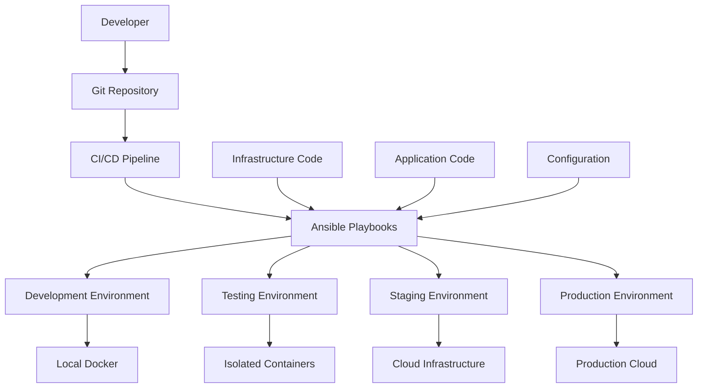
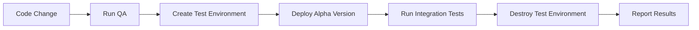
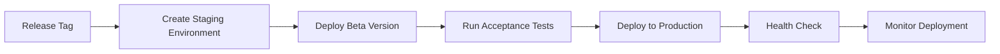

# 🏗️ Infrastructure as Code Strategy

> [!IMPORTANT]
> This document outlines the infrastructure automation strategy for the agent template, focusing on push-button environments and automated deployment through Ansible.

## Table of Contents

- [🏗️ Infrastructure as Code Strategy](#️-infrastructure-as-code-strategy)
  - [Table of Contents](#table-of-contents)
  - [🎯 Vision](#-vision)
  - [🔧 Technology Stack](#-technology-stack)
  - [🏗️ Architecture Overview](#️-architecture-overview)
  - [📦 Environment Types](#-environment-types)
  - [🚀 Push-Button Environments](#-push-button-environments)
  - [🔄 Ansible Automation](#-ansible-automation)
  - [🧪 Testing Infrastructure](#-testing-infrastructure)
  - [📋 Implementation Roadmap](#-implementation-roadmap)
  - [🛠️ Getting Started](#️-getting-started)

[↑ Back to Top](#table-of-contents)

## 🎯 Vision

**Goal:** Complete infrastructure automation that enables push-button environment creation, deployment, and testing across all environments from development to production.

**Core Principles:**
- **Infrastructure as Code** - All infrastructure defined in version-controlled code
- **Environment Parity** - Consistent environments across dev, staging, production
- **Push-Button Deployment** - Single command environment creation and updates
- **Automated Testing** - Infrastructure and application testing in isolated environments
- **Disaster Recovery** - Quick environment recreation and backup/restore procedures

**Ultimate Target:**
```bash
# Single command to create complete environment
ansible-playbook deploy.yml -e env=production -e version=v1.3.0

# Single command to run tests in isolated environment  
ansible-playbook test.yml -e test_suite=integration -e version=v1.3.0-alpha.1
```

[↑ Back to Top](#table-of-contents)

## 🔧 Technology Stack

**Infrastructure Automation:**
- **Ansible** - Primary infrastructure automation and configuration management
- **Docker** - Application containerization and consistency
- **Docker Compose** - Local development environment orchestration
- **Terraform** (Future) - Cloud infrastructure provisioning

**Environment Management:**
- **Development** - Local Docker containers + SQLite
- **Testing** - Isolated containers with PostgreSQL
- **Staging** - Cloud-based environment mirroring production
- **Production** - Scalable cloud deployment with monitoring

**Monitoring & Observability:**
- **Application Logs** - Structured logging with correlation IDs
- **Health Checks** - Comprehensive service health monitoring
- **Metrics** - Performance and business metrics collection
- **Alerting** - Automated incident response

[↑ Back to Top](#table-of-contents)

## 🏗️ Architecture Overview



**Component Responsibilities:**
- **Ansible Playbooks** - Environment provisioning and configuration
- **Docker Images** - Application packaging and consistency
- **Configuration Management** - Environment-specific settings
- **CI/CD Integration** - Automated deployment triggers
- **Monitoring** - Health checks and observability

[↑ Back to Top](#table-of-contents)

## 📦 Environment Types

### 🔧 Development Environment
[↑ Back to Top](#table-of-contents)

**Characteristics:**
- Local development on developer machines
- SQLite database for rapid iteration
- Hot reloading and debugging capabilities
- Minimal resource requirements

**Provisioning:**
```bash
# Current manual setup
make dev

# Future automated setup
ansible-playbook environments/development.yml
```

### 🧪 Testing Environment
[↑ Back to Top](#table-of-contents)

**Characteristics:**
- Isolated containerized environment
- PostgreSQL database for production parity
- Automated test execution
- Ephemeral - created and destroyed per test run

**Provisioning:**
```bash
# Future automated testing
ansible-playbook environments/testing.yml -e version=v1.3.0-alpha.1
```

### 🎭 Staging Environment
[↑ Back to Top](#table-of-contents)

**Characteristics:**
- Production-like cloud environment
- Full monitoring and observability
- User acceptance testing
- Performance testing capabilities

**Provisioning:**
```bash
# Future staging deployment
ansible-playbook environments/staging.yml -e version=v1.3.0-beta.1
```

### 🚀 Production Environment
[↑ Back to Top](#table-of-contents)

**Characteristics:**
- Highly available and scalable
- Full monitoring, alerting, and logging
- Automated backup and disaster recovery
- Blue-green deployment capabilities

**Provisioning:**
```bash
# Future production deployment
ansible-playbook environments/production.yml -e version=v1.3.0
```

[↑ Back to Top](#table-of-contents)

## 🚀 Push-Button Environments

### 🎯 Environment Creation Goals
[↑ Back to Top](#table-of-contents)

**Single Command Environment Creation:**
```bash
# Create development environment
ansible-playbook create-env.yml -e env=dev -e context=agent_project

# Create testing environment with specific version
ansible-playbook create-env.yml -e env=test -e version=v1.3.0-alpha.1

# Create production environment
ansible-playbook create-env.yml -e env=prod -e version=v1.3.0
```

**Environment Destruction:**
```bash
# Clean shutdown and resource cleanup
ansible-playbook destroy-env.yml -e env=test -e preserve_data=false
```

### 🔄 Automated Workflows
[↑ Back to Top](#table-of-contents)

**Development Workflow:**


**Production Deployment:**


[↑ Back to Top](#table-of-contents)

## 🔄 Ansible Automation

### 📁 Directory Structure
[↑ Back to Top](#table-of-contents)

**Future Ansible Organization:**
```
ansible/
├── inventories/                 # Environment inventories
│   ├── development/
│   ├── testing/
│   ├── staging/
│   └── production/
├── playbooks/                   # Main playbooks
│   ├── deploy.yml              # Application deployment
│   ├── provision.yml           # Infrastructure provisioning
│   ├── test.yml                # Automated testing
│   └── destroy.yml             # Environment cleanup
├── roles/                       # Reusable roles
│   ├── agent_project/          # Agent application role
│   ├── database/               # Database setup role
│   ├── monitoring/             # Monitoring setup role
│   └── security/               # Security configuration role
├── group_vars/                 # Group variables
│   ├── all.yml                 # Global variables
│   ├── development.yml         # Dev-specific variables
│   ├── staging.yml             # Staging-specific variables
│   └── production.yml          # Production-specific variables
└── host_vars/                  # Host-specific variables
```

### 🎭 Playbook Examples
[↑ Back to Top](#table-of-contents)

**Application Deployment Playbook:**
```yaml
# playbooks/deploy.yml
---
- name: Deploy Agent Application
  hosts: "{{ env }}"
  vars:
    app_version: "{{ version | default('latest') }}"
    bounded_context: "{{ context | default('agent_project') }}"
  
  tasks:
    - name: Pull application image
      docker_image:
        name: "agent-template:{{ app_version }}"
        source: pull
    
    - name: Deploy bounded context
      docker_compose:
        project_name: "{{ bounded_context }}"
        definition:
          version: '3.8'
          services:
            app:
              image: "agent-template:{{ app_version }}"
              environment:
                DATABASE_URL: "{{ database_url }}"
                LOG_LEVEL: "{{ log_level }}"
    
    - name: Run health checks
      uri:
        url: "http://localhost:8000/health"
        method: GET
      retries: 10
      delay: 5
```

**Environment Provisioning:**
```yaml
# playbooks/provision.yml
---
- name: Provision Environment Infrastructure
  hosts: localhost
  vars:
    env_type: "{{ env }}"
    
  tasks:
    - name: Create Docker network
      docker_network:
        name: "{{ env_type }}-network"
        
    - name: Setup database
      include_role:
        name: database
      vars:
        db_type: "{{ 'sqlite' if env_type == 'development' else 'postgresql' }}"
        
    - name: Setup monitoring
      include_role:
        name: monitoring
      when: env_type in ['staging', 'production']
```

[↑ Back to Top](#table-of-contents)

## 🧪 Testing Infrastructure

### 🚀 Push-Button Testing
[↑ Back to Top](#table-of-contents)

**Automated Test Environments:**
```bash
# Create isolated test environment and run tests
ansible-playbook test-pipeline.yml \
  -e version=v1.3.0-alpha.1 \
  -e test_suite=integration \
  -e cleanup=true
```

**Test Pipeline Workflow:**
1. **Environment Creation** - Spin up isolated test infrastructure
2. **Application Deployment** - Deploy specific version to test environment
3. **Test Execution** - Run comprehensive test suite
4. **Results Collection** - Gather test results and logs
5. **Environment Cleanup** - Destroy test environment and cleanup resources

### 🔍 Test Types
[↑ Back to Top](#table-of-contents)

**Integration Testing:**
- End-to-end workflow testing
- Database integration validation
- API endpoint testing
- Cross-bounded-context testing

**Performance Testing:**
- Load testing under realistic conditions
- Memory and CPU usage validation
- Database performance testing
- Scaling behavior verification

**Security Testing:**
- Vulnerability scanning
- Authentication and authorization testing
- Data protection validation
- Network security verification

[↑ Back to Top](#table-of-contents)

## 📋 Implementation Roadmap

### 🎯 Phase 1: Foundation (Immediate)
[↑ Back to Top](#table-of-contents)

**Goals:**
- [ ] Ansible directory structure setup
- [ ] Basic development environment playbook
- [ ] Docker image build automation
- [ ] Simple deployment playbook

**Deliverables:**
- Development environment automation
- Basic CI/CD integration
- Docker image standardization

### 🏗️ Phase 2: Testing Automation (Short Term)
[↑ Back to Top](#table-of-contents)

**Goals:**
- [ ] Automated test environment creation
- [ ] Integration testing pipeline
- [ ] Test result reporting
- [ ] Environment cleanup automation

**Deliverables:**
- Push-button testing environments
- Automated test execution
- Comprehensive test reporting

### 🚀 Phase 3: Production Readiness (Medium Term)
[↑ Back to Top](#table-of-contents)

**Goals:**
- [ ] Staging environment automation
- [ ] Production deployment pipeline
- [ ] Monitoring and alerting setup
- [ ] Backup and disaster recovery

**Deliverables:**
- Production-ready deployment pipeline
- Full monitoring and observability
- Disaster recovery procedures

### 🌐 Phase 4: Cloud Integration (Long Term)
[↑ Back to Top](#table-of-contents)

**Goals:**
- [ ] Cloud infrastructure provisioning
- [ ] Auto-scaling capabilities
- [ ] Multi-region deployment
- [ ] Advanced monitoring and analytics

**Deliverables:**
- Cloud-native infrastructure
- Enterprise-grade scalability
- Advanced operational capabilities

[↑ Back to Top](#table-of-contents)

## 🛠️ Getting Started

**Prerequisites:**
```bash
# Install Ansible
pip install ansible

# Install Docker
# Platform-specific installation

# Install required Ansible collections
ansible-galaxy collection install community.docker
ansible-galaxy collection install community.postgresql
```

**Initial Setup:**
```bash
# 1. Create ansible directory structure
mkdir -p ansible/{inventories,playbooks,roles,group_vars,host_vars}

# 2. Initialize basic inventory
echo "localhost ansible_connection=local" > ansible/inventories/development/hosts

# 3. Create basic development playbook
# (See examples above)

# 4. Test basic functionality
ansible-playbook ansible/playbooks/development.yml -i ansible/inventories/development/hosts
```

**Current Manual Process (Temporary):**
```bash
# Until automation is complete, use manual process
make dev          # Setup and start development
make qa           # Quality assurance
make docker-build # Build Docker image
make docker-run   # Run in Docker
```

> [!NOTE]
> This infrastructure strategy supports both current manual development and future automated deployments, providing a clear evolution path from development to enterprise-grade operations.

[↑ Back to Top](#table-of-contents)

---

**Infrastructure Version:** 1.0.0  
**Last Updated:** 2025-06-27  
**Focus:** Push-button environments, automated testing, enterprise operations 