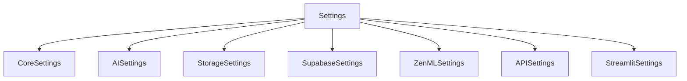

# ⚙️ Application Settings Configuration

> [!IMPORTANT]
> All application settings are centralized in `src/settings.py`. This is the single source of truth for configuration.

## 📑 Table of Contents

- [Overview](#-overview)
- [Settings Modules](#-settings-modules)
- [Usage Examples](#-usage-examples)
- [Environment Variables](#-environment-variables)
- [Best Practices](#-best-practices)

[↑ Back to Top](#-application-settings-configuration)

## 🎯 Overview

The application uses a modular settings system built with Pydantic, providing:



> [!TIP]
> Access settings through the global `settings` instance: `from src.settings import settings`

[↑ Back to Top](#-application-settings-configuration)

## 📦 Settings Modules

### CoreSettings
Core application configuration:
```python
settings.core.APP_ENV       # Application environment
settings.core.LOG_LEVEL     # Logging level
settings.core.BASE_DIR      # Base directory path
settings.core.LOGS_DIR      # Logs directory path
```

### AISettings
AI-related settings:
```python
settings.ai.OPENAI_API_KEY           # OpenAI API key
settings.ai.OPENAI_MODEL_ID          # OpenAI model identifier
settings.ai.HUGGINGFACE_ACCESS_TOKEN # Huggingface token
```

### StorageSettings
Storage configuration:
```python
settings.storage.S3_ACCESS_KEY       # S3 access key
settings.storage.S3_SECRET_KEY       # S3 secret key
settings.storage.AUDIO_FILES_DIR     # Audio files directory
settings.storage.MAX_AUDIO_SIZE_MB   # Maximum audio file size
```

### SupabaseSettings
Supabase configuration:
```python
settings.supabase.SUPABASE_URL        # Supabase URL
settings.supabase.SUPABASE_KEY        # Supabase key
settings.supabase.SUPABASE_JWT_SECRET # JWT secret
```

### ZenMLSettings
ZenML configuration:
```python
settings.zenml.ZENML_STORE_URL    # ZenML store URL
settings.zenml.ZENML_SERVER_HOST  # ZenML server host
settings.zenml.ZENML_SERVER_PORT  # ZenML server port
```

### APISettings
FastAPI configuration:
```python
settings.api.API_TITLE          # API title
settings.api.API_VERSION        # API version
settings.api.ALLOW_ORIGINS     # CORS allowed origins
```

### StreamlitSettings
Streamlit configuration:
```python
settings.streamlit.API_BASE_URL          # API base URL
settings.streamlit.API_HEALTH_URL        # Health check URL
settings.streamlit.ALLOWED_FILE_TYPES    # Allowed file types
```

[↑ Back to Top](#-application-settings-configuration)

## 🚀 Usage Examples

### Basic Usage
```python
from src.settings import settings

# Access settings from different modules
log_level = settings.core.LOG_LEVEL
api_key = settings.ai.OPENAI_API_KEY
max_size = settings.storage.MAX_AUDIO_SIZE_MB
```

### With Environment Variables
```python
# .env file
OPENAI_API_KEY=your-api-key
LOG_LEVEL=DEBUG
MAX_AUDIO_SIZE_MB=50
```

[↑ Back to Top](#-application-settings-configuration)

## 🔧 Environment Variables

> [!IMPORTANT]
> Settings are loaded from environment variables and `.env` file

### Required Variables
- `OPENAI_API_KEY`: OpenAI API key for transcription
- `SUPABASE_URL`: Supabase instance URL (if using Supabase)
- `SUPABASE_KEY`: Supabase API key (if using Supabase)

### Optional Variables
- `APP_ENV`: Application environment (default: "development")
- `LOG_LEVEL`: Logging level (default: "DEBUG")
- `MAX_AUDIO_SIZE_MB`: Maximum audio file size (default: 25)

[↑ Back to Top](#-application-settings-configuration)

## ✅ Best Practices

1. **Environment Variables**
   - Use `.env` file for local development
   - Use system environment variables in production
   - Never commit sensitive values to version control

2. **Accessing Settings**
   - Always import from `src.settings`
   - Use the appropriate settings module
   - Avoid creating new settings instances

3. **Adding New Settings**
   - Add to the appropriate settings module
   - Document in this file
   - Update `.env.example` if needed

> [!WARNING]
> Never import settings from deprecated locations or create separate settings files

[↑ Back to Top](#-application-settings-configuration) 