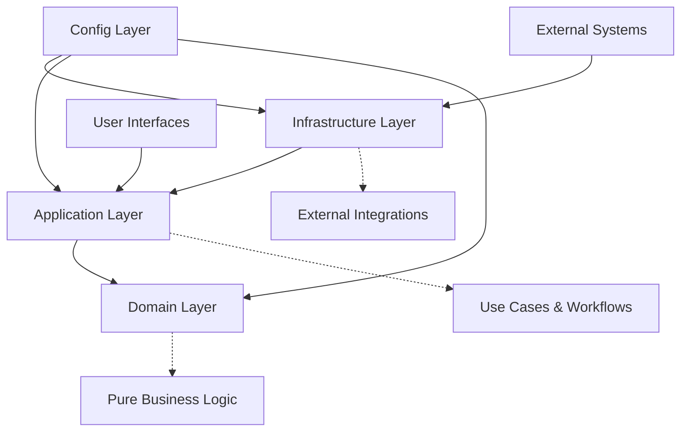

# Source Code Architecture

This directory contains the main bounded context for the agent project following Domain-Driven Design (DDD) and Clean Architecture principles.

## 🏗️ Directory Structure

```
src/
└── agent_project/          # Main Bounded Context (easily copyable)
    ├── domain/             # Domain Layer - Core Business Logic
    ├── application/        # Application Layer - Use Cases & Services
    ├── infrastructure/     # Infrastructure Layer - External Integrations
    └── config/             # Configuration Management
```

## 🎯 Bounded Context: `agent_project`

The `agent_project` directory represents a **bounded context** - a self-contained module that can be easily copied and reused across different projects. This is the heart of your agent application.

### 🔄 Why This Structure?

**Portability**: The entire `agent_project` folder can be copied to any other project and work independently.

**Clean Dependencies**: Dependencies flow inward following Clean Architecture:
```
infrastructure/ → application/ → domain/
config/ → (used by all layers)
```

**Testability**: Each layer can be tested in isolation with clear interfaces.

## 📂 Layer Responsibilities

### 🧠 Domain Layer (`domain/`)
**Purpose**: Core business logic and domain models
**Contains**:
- Entity classes and value objects
- Domain events and business rules
- Agent interfaces and protocols
- Prompt management domain logic
- Tool definitions and contracts

**Key Principles**:
- No dependencies on external frameworks
- Pure Python business logic
- Framework-agnostic interfaces

**Example Contents**:
```
domain/
├── entities/           # Agent, Conversation, Memory entities
├── events/            # Domain events (conversation started, tool used)
├── services/          # Domain services (prompt validation, tool selection)
└── interfaces/        # Contracts and protocols
```

### ⚙️ Application Layer (`application/`)
**Purpose**: Orchestrates business workflows and use cases
**Contains**:
- Application services (ConversationService, ToolService)
- Use case implementations
- Application-level coordination
- Service interfaces and DTOs

**Key Principles**:
- Orchestrates domain objects
- Implements use cases
- Contains no business rules (delegates to domain)

**Example Contents**:
```
application/
├── services/          # Application services
├── use_cases/         # Specific use case implementations
├── interfaces/        # Service contracts
└── dtos/             # Data Transfer Objects
```

### 🔌 Infrastructure Layer (`infrastructure/`)
**Purpose**: External integrations and technical implementations
**Contains**:
- LLM client implementations (OpenAI, Anthropic)
- Database adapters and repositories
- Event bus implementations
- Monitoring and logging infrastructure
- Vector database clients

**Key Principles**:
- Implements interfaces defined in domain/application
- Contains all external dependencies
- Adapts external services to internal interfaces

**Example Contents**:
```
infrastructure/
├── llm/              # LLM client implementations
├── database/         # Database adapters
├── event_bus/        # Event handling implementations
├── monitoring/       # Logging and metrics
└── repositories/     # Data persistence implementations
```

### ⚙️ Config Layer (`config/`)
**Purpose**: Configuration management for the bounded context
**Contains**:
- Settings classes and validation
- Environment variable management
- Configuration constants
- Startup banner and logging setup

**Design Decision**: Config is inside the bounded context to make it self-contained and portable. This differs from pure DDD where config might be external, but supports our template/portability goals.

## 🚀 Bounded Context Benefits

### ✅ Portability
```bash
# Copy the entire bounded context to a new project
cp -r src/agent_project/ ../new-project/src/my_agent/
```

### ✅ Independence
- Self-contained with minimal external dependencies
- Clear interface contracts
- Internal implementation details hidden

### ✅ Testability
- Each layer can be unit tested independently
- Clear dependency injection points
- Mock-friendly interfaces

### ✅ Maintainability
- Separation of concerns
- Single responsibility per layer
- Easy to understand and modify

## 🔄 Dependency Flow



## 🎯 Usage Examples

### Importing from the Bounded Context
```python
# From external applications (apps/, tools/, etc.)
from src.agent_project.application.services import ConversationService
from src.agent_project.domain.entities import Agent
from src.agent_project.infrastructure.llm import OpenAIClient

# Within the bounded context
from src.agent_project.domain.interfaces import AgentProtocol
from src.agent_project.config import get_settings
```

### Creating New Components
```python
# 1. Define interface in domain/
class ToolProtocol(Protocol):
    def execute(self, params: dict) -> str: ...

# 2. Implement in infrastructure/
class WeatherTool:
    def execute(self, params: dict) -> str:
        # External API call implementation
        return weather_data

# 3. Use in application/
class ToolService:
    def __init__(self, tool: ToolProtocol):
        self.tool = tool
```

## 📋 Best Practices

### ✅ Do
- Keep domain layer pure (no external dependencies)
- Use dependency injection for infrastructure components
- Define clear interfaces between layers
- Keep the bounded context self-contained
- Test each layer independently

### ❌ Don't
- Put business logic in infrastructure layer
- Let domain layer depend on infrastructure
- Tightly couple to specific external services
- Mix concerns across layers
- Create circular dependencies

## 🔧 Configuration Philosophy

Config is placed within the bounded context to support the template's primary goal: **easy portability and reusability**. While this differs from pure DDD (where config might be external), it ensures the bounded context is truly self-contained and can be dropped into any project with minimal setup.

This design choice prioritizes:
- **Developer Experience**: Everything needed is in one place
- **Template Usability**: Copy and use immediately  
- **Reduced Coupling**: No external config dependencies

## 🚀 Next Steps

1. **Customize the bounded context** for your specific agent needs
2. **Implement your domain entities** (Agent, Tools, Memory, etc.)
3. **Create application services** for your use cases
4. **Add infrastructure adapters** for your external systems
5. **Test each layer** independently
6. **Copy to new projects** as needed

This architecture provides a solid foundation for building production-ready agent systems that are maintainable, testable, and easily portable across projects. 